# 使用场景

当您使用 Custom Container 函数时，您希望在将镜像推送到 ARC 镜像仓库后自动更新函数的镜像。

# 实现原理

通过 EventBridge 的 HTTP URL 触发一个函数，在这个函数中通过使用 FC 的 SDK 来更新目标函数的镜像。

# 具体步骤

1. 通过阿里云函数计算控制台在任何地域创建一个“使用标准 Runtime 从零创建”，“Node.js 14”，“处理事件请求”的函数。
   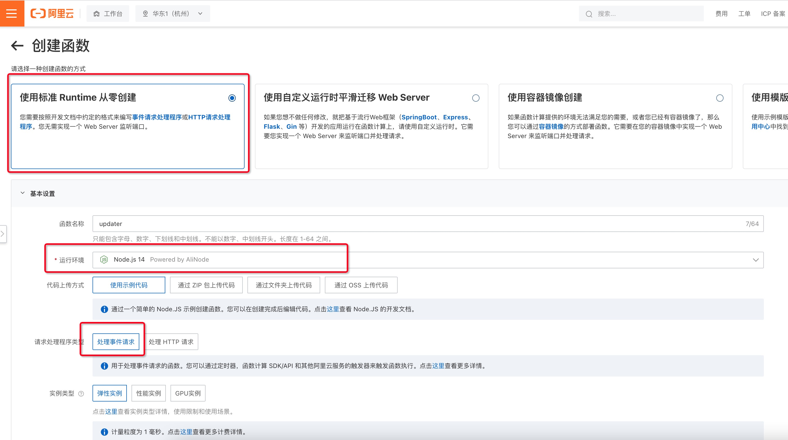
2. 使用当前 GitHub `index.js` 中的内容替换函数，并点击“部署”。
   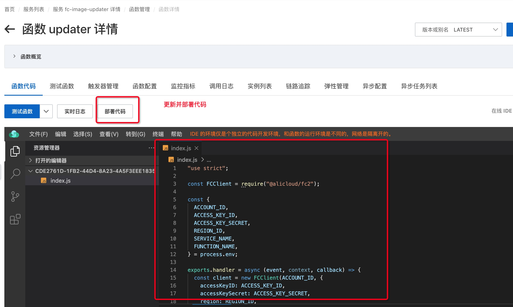
3. 使用您容器函数的服务名，函数名，地域名，和您自己账号的 ID，AK，SK 替换当前 GitHub `environments.json` 中的内容，并在函数计算控制台“编辑环境变量”，“使用 JSON 格式编辑” 更新环境变量。
   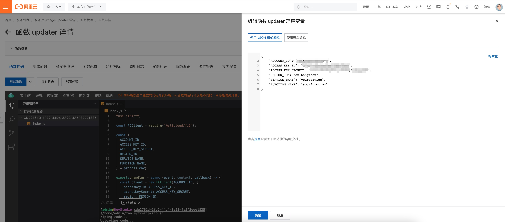
4. 在[事件总线 EventBridge 控制台](https://eventbridge.console.aliyun.com/cn-hangzhou/event-buses)创建自定义事件总线。事件源为 HTTP/HTTPS 触发，规则为默认规则，目标为第一步中创建的函数，并且调用方式位“异步”。
   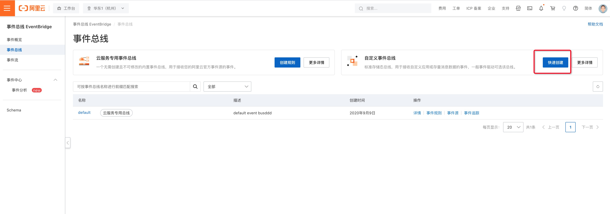
   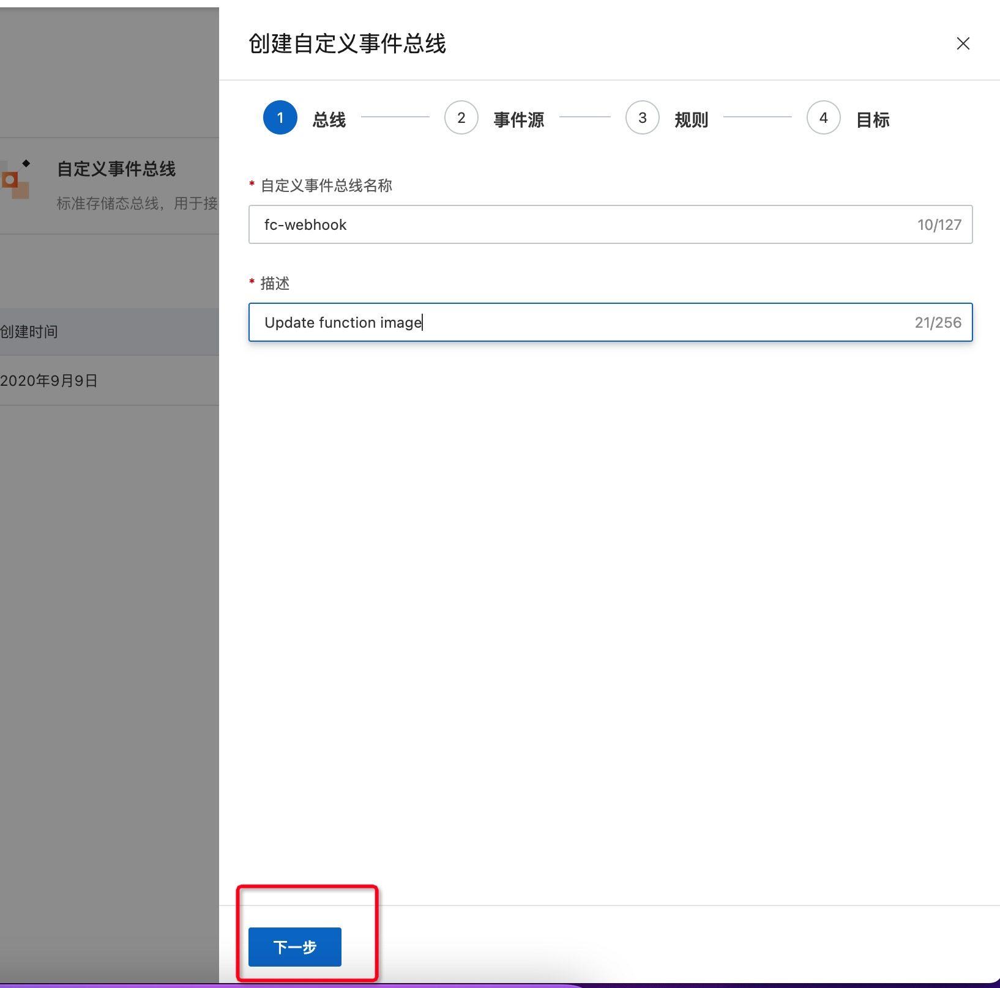
   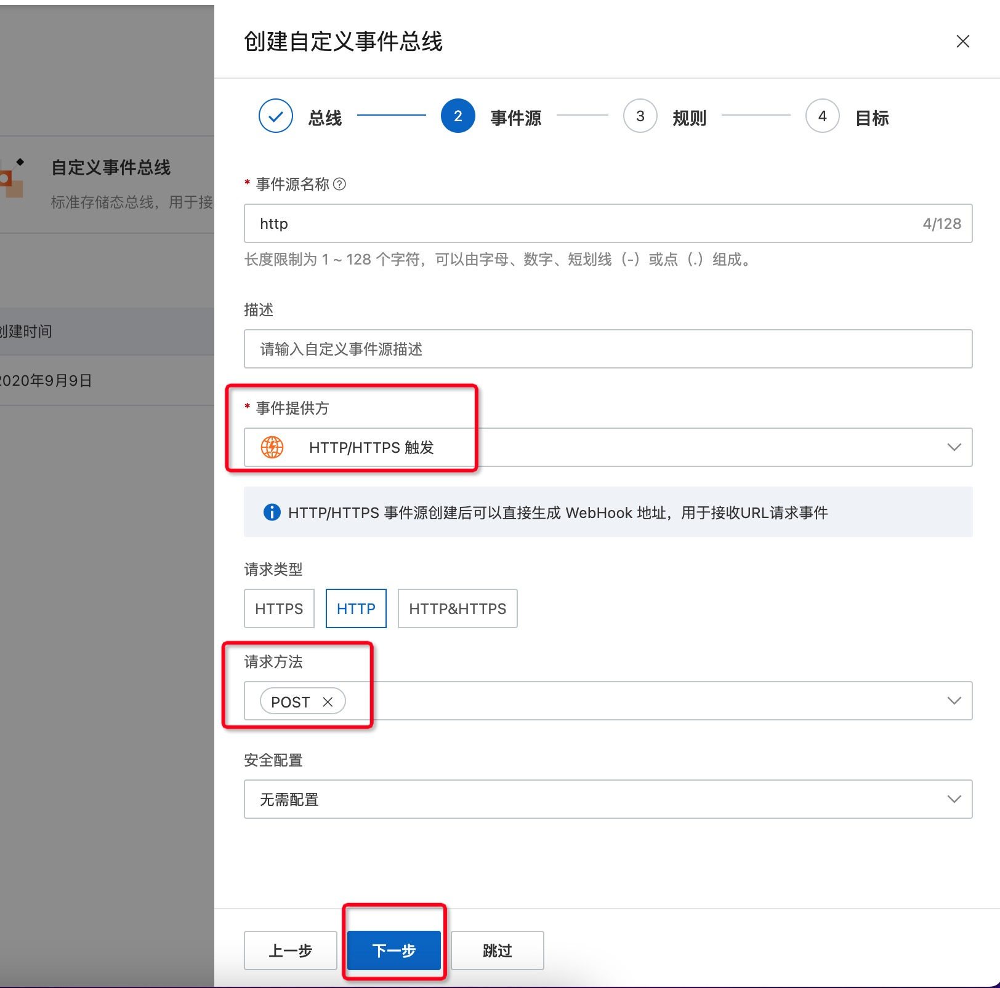
   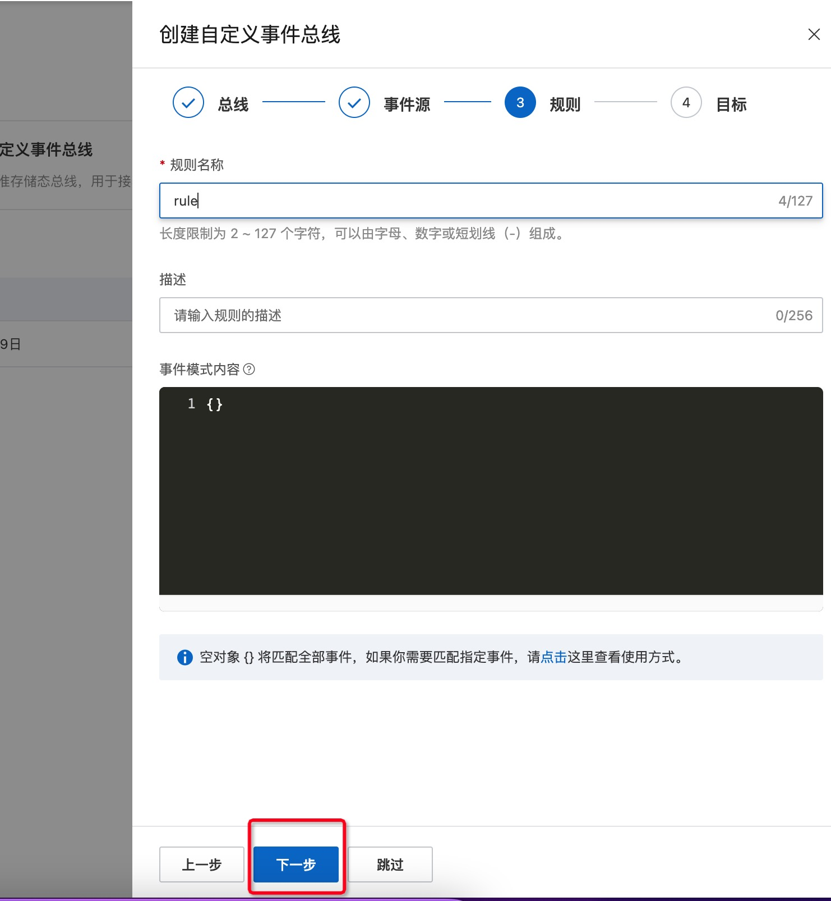
   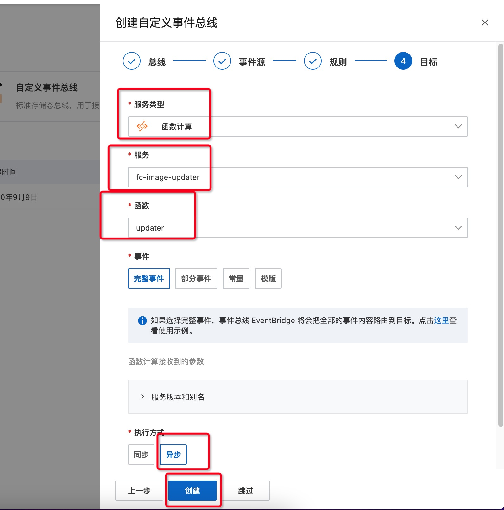
5. 在创建好的“自定义总线”->“事件源”-> “事件源详情” 页面找到“公网请求 URL”。
   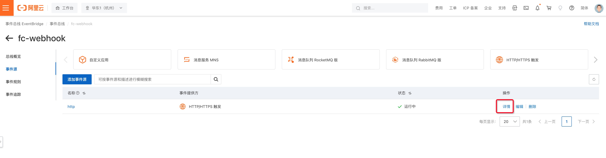
   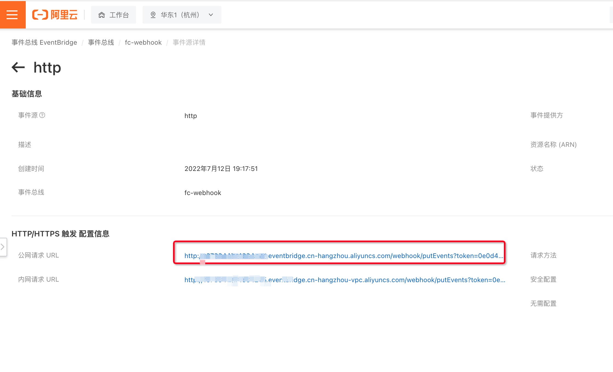
6. 在[镜像服务控制台](https://cr.console.aliyun.com/)配置触发器，并将上一步中找到的“公网请求 URL”配置进去。
   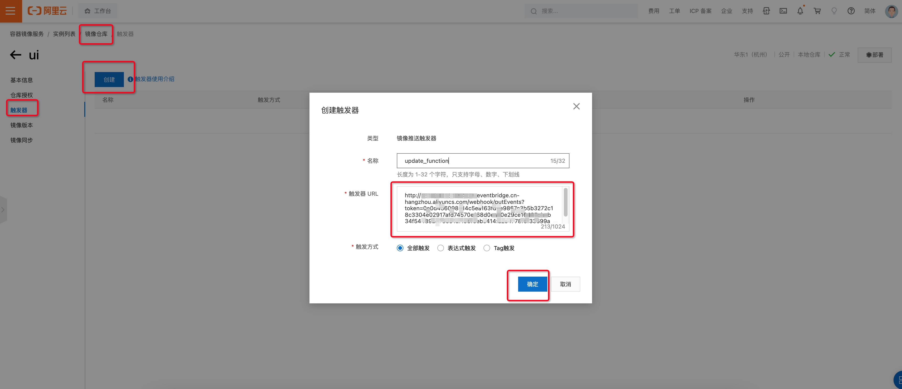